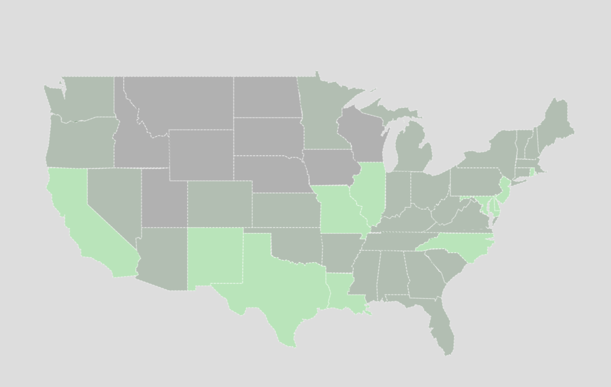
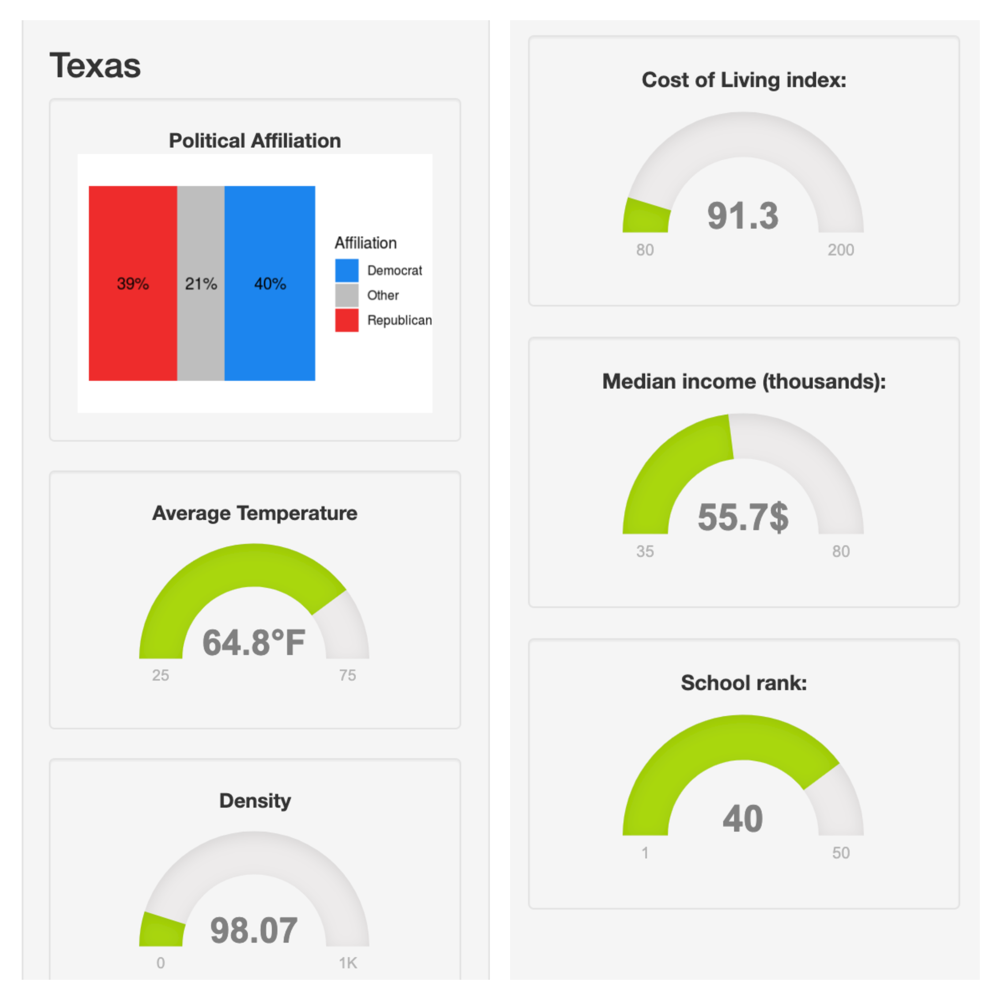

```{r set-options, include = FALSE}
# Sets default chunk options
knitr::opts_chunk$set(
  # Figures/Images will be centered
  fig.align = "center", 
  # Code will not be displayed unless `echo = TRUE` is set for a chunk
  echo = FALSE,
  # Messages are suppressed
  message = FALSE,
  # Warnings are suppressed
  warning = FALSE
)
```

```{r install-and-load-packages, include = FALSE}
# All packages needed should be loaded in this chunk
pkg_list = c('knitr', 'kableExtra', 'magrittr')

# Determine what packages are NOT installed already.
to_install_pkgs = pkg_list[!(pkg_list %in% installed.packages()[,"Package"])]

# Install the missing packages
if(length(to_install_pkgs)) {
  install.packages(to_install_pkgs, repos = "https://cloud.r-project.org")
}

# Load all packages
sapply(pkg_list, require, character.only = TRUE)
```

\newpage

# Introduction

For our Project, we decided to make a program that makes it easy for the user to find a state in the United States that fits their desires. When people are choosing where to live, there are some standard factors that most people focus on in order to choose the best state to live in [@best-states].

With our program you are able to customize the parameters of multiple factors, and immediately see a map of the results that match your selections. This program uses `R` and `shiny` in order to make an easy to use and highly beneficial tool for people that are looking for states with certain attributes. The data being used is taken from multiple sources that have different information about each state in the United States. These factors include Political Affiliation, Average Temperature, Density, Cost of Living, Median Home Income, and School Rank. The user is able to select ranges and weights for each one in order to find the best state for them.

# Related Work

Initially, we discussed whether we should narrow in the types of factors to be included in the project. Specifically, factors that are all related to crimes, so that the goal of this project is to find the safest counties to live in. But, crime maps already exist. So, we changed our motivation to create a program that users can play around with in order to find the best counties to live in. There is already a map of crime data [@crime], a map of home prices [@zillow], and a website for climate data [@climate], but there isn't one that combines all of these, and more. So why not combine and utilize all these data to create user-friendly program? 

In the end, we all pitched in on what a person most likely will consider before deciding the best state to live in. Factors that we have all decided to use for our project are political affiliation, average temperature, population density, median household income, school ratings, and cost of living. For references for each factors we used [Pew Research Center](https://www.pewforum.org/religious-landscape-study/compare/party-affiliation/by/state/), [Current Results](https://www.currentresults.com/Weather/US/average-annual-state-temperatures.php), [Money](http://money.com/money/5177566/average-income-every-state-real-value/), [SchoolDigger](https://www.schooldigger.com/stateuserrankings.aspx), and [Missouri Economy](https://www.missourieconomy.org/indicators/cost_of_living/) respectively. 


# Methods

When the program starts, data is imported by web scraping. Web scraping for each variable begins with `rvest` [@rvest]. The HTML of each page is parsed into data frames. Variables of interest are selected from the data sets and combined into a master data frame.

On the UI side, the main section is an interactive map of the United States, created with `leaflet` [@leaflet]. There is a sidebar with two tabs. The first tab is a search panel. The user is able to select bounds for variables of interest (Avg. temperature, Crime rate, etc.), apply weights for how much they care about the variable, and search for states that match these criteria. A model is formed to light the states green based on how well they match the search parameters. States that are completely gray do not match the selected parameters at all, while states that are completely green are a perfect fit. This communicates to the user which states are best for them. At any time, the user is able to select a state, which automatically switches to the second tab, Details.

In the details tab, there is a stacked bar graph to show political affiliation, and gauges created with `flexdashboard` [@flexdashboard] that show every variable of interest for the selected state.


```{r ui-default, out.width = "350px", fig.cap = "UI Default"}
knitr::include_graphics("images/ui-default.png")
```

```{r ui-details, out.width = "350px", fig.cap = "UI Details"}
knitr::include_graphics("images/ui-details.png")
```

\newpage

# Results

After the user selected bounds and weights, the user will be able click search to see the US map with different shades of green, as discussed in the methods section. 

```{r resultsui, out.width = "400px", fig.cap = "UI after variable selection", fig.pos = 'H'}

```

Here we have an example. After selecting bounds and weights, we can see that there are 11 states to choose from as they colored completely in green. 

After clicking one of the states, the details tab will show more statistics for each variable of interest. 

```{r resultsdetail, out.width = "400px", fig.cap = "Details Tab", fig.pos = 'H'}

```

# Discussion

The states light up green based on how well they match your selection. The goal of the project is to find the best state or states. Therefore, the more green, the more favorable the state. As the user narrows their bounds for each parameter, the selection of states will also narrow down, making it easier to choose a state that fits their specified preferences.

# Conclusion

Essentially, this project is geared towards those looking for the most ideal state based off of their preferences of the provided variables. This is done by allowing users to choose the parameters for each variable and the weight of the parameter as well. For example, someone who is already retired and doesn't have kids may not care a lot about the nearby education systems as opposed to a family with kids, so they could set the school rank weight to 0. Or an individual may prefer relatively colder weather as opposed to something warmer like Florida. In this case they could set the weight of average temperature to 2 if it is more important to them.  

In summary, someone could pick what variable(s) they value most (such as a cooler climate, or high school rank) and find the most suitable state based off of their own preferences.

\newpage

# References

"Average Annual Temperature for Each US State." Average Annual 
Temperatures by USA State - Current Results. Accessed May 08, 2019. https://www.currentresults.com/Weather/US/average-annual-state-temperatures.php.

"Cost of Living Annual Average 2018." Cost of Living Annual Average 2018. Accessed May 08, 2019.
https://www.missourieconomy.org/indicators/cost_of_living/.

"Party Affiliation by State - Religion in America: U.S. Religious 
Data, Demographics and Statistics." Pew Research Center's Religion & Public Life Project. May 11, 2015. Accessed May 08, 2019. https://www.pewforum.org/religious-landscape-study/compare/party-affiliation/by/state/.

R Core Team (2018). R: A language and environment for statistical 
computing. R Foundation for Statistical Computing, Vienna, Austria. URL  https://www.R-project.org/.

"School Ratings by State from SchoolDigger.com Site Visitors." 
SchoolDigger. Accessed May 08, 2019. https://www.schooldigger.com/stateuserrankings.aspx.

"This Map Shows the Average Income in Every State-and What It's Really 
Worth." Money. Accessed May 08, 2019. http://money.com/money/5177566/average-income-every-state-real-value/.

Winston Chang, Joe Cheng, JJ Allaire, Yihui Xie and Jonathan McPherson
(2018). shiny: Web Application Framework for R. R package version
1.2.0. http://shiny.rstudio.com
