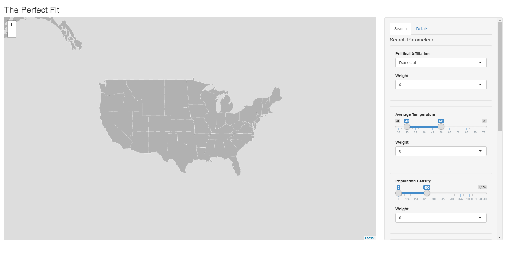
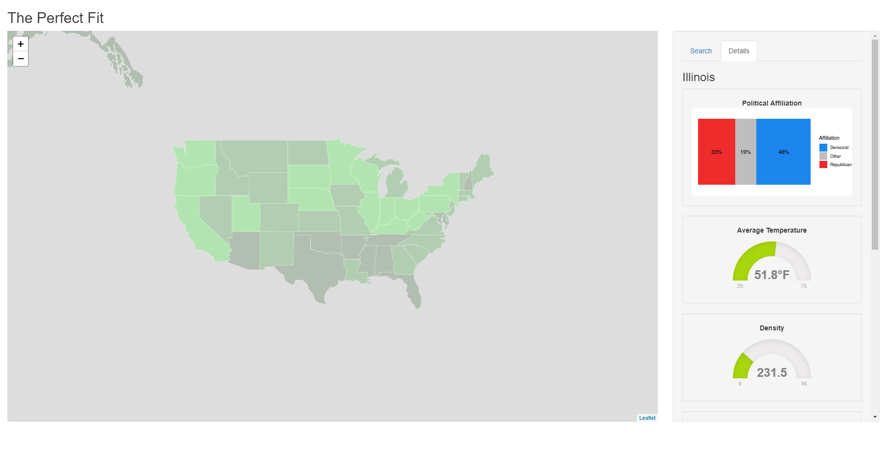

```{r set-options, include = FALSE}
# Sets default chunk options
knitr::opts_chunk$set(
  # Figures/Images will be centered
  fig.align = "center", 
  # Code will not be displayed unless `echo = TRUE` is set for a chunk
  echo = FALSE,
  # Messages are suppressed
  message = FALSE,
  # Warnings are suppressed
  warning = FALSE
)
```

```{r install-and-load-packages, include = FALSE}
# All packages needed should be loaded in this chunk
pkg_list = c('knitr', 'kableExtra', 'magrittr')

# Determine what packages are NOT installed already.
to_install_pkgs = pkg_list[!(pkg_list %in% installed.packages()[,"Package"])]

# Install the missing packages
if(length(to_install_pkgs)) {
  install.packages(to_install_pkgs, repos = "https://cloud.r-project.org")
}

# Load all packages
sapply(pkg_list, require, character.only = TRUE)
```

\newpage

# Introduction

For our Project, we decided to make a program that makes it easy for the user to find a state in the United States that fits their desires. When people are choosing where to live, there are some standard factors that most people focus on in order to choose the best county to live in [@best-counties].

With our program you are able to customize the parameters of multiple factors, and immediately see a map of the results that match your selections. This program uses `R` and `shiny` in order to make an easy to use and highly beneficial tool for people that are looking for states with certain attributes. The data being used is taken from multiple sources that have different information about each state in the United States. These factors include Political Affiliation, Average Temperature, Density, Cost of Living, Median Home Income, and School Rank. The user is able to select ranges and weights for each one in order to find the best state for them.

# Related Work

Initially, we discussed whether we should narrow in the types of factors to be included in the project. Specifically, factors that are all related to crimes, so that the goal of this project is to find the safest counties to live in. But, crime maps already exist. So, we changed our motivation to create a program that users can play around with in order to find the best counties to live in. There is already a map of crime data [@crime], a map of home prices [@zillow], and a website for climate data [@climate], but there isn't one that combines all of these, and more. So why not combine and utilize all these data to create user-friendly program? 

In the end, we all pitched in on what a person most likely will consider before deciding the best state to live in. Factors that we have all decided to use for our project are political affiliate, average temperature, median household income, school ratings, and cost of living.For references for each factors we used [Pew Research Center](https://www.pewforum.org/religious-landscape-study/compare/party-affiliation/by/state/), [Current Results](https://www.currentresults.com/Weather/US/average-annual-state-temperatures.php), [Money](http://money.com/money/5177566/average-income-every-state-real-value/), [SchoolDigger](https://www.schooldigger.com/stateuserrankings.aspx), and [Missouri Economy](https://www.missourieconomy.org/indicators/cost_of_living/) respectively. 


# Methods

When the program starts, data is imported by web scraping. Web scraping for each variable begins with `rvest` [@rvest]. The HTML of each page is parsed into data frames. Variables of interest are selected from the data sets and combined into a master data frame.

On the UI side, the main section is an interactive map of the United States, created with `leaflet` [@leaflet]. There is a sidebar with two tabs. The first tab is a search panel. The user is able to select bounds for variables of interest (Avg. temperature, Crime rate, etc.), apply weights for how much they care about the variable, and search for states that match these criteria. A model is formed to light the states green based on how well they match the search parameters. States are completely gray do not match the selected parameters at all, while completely green states are a perfect fit. This communicates to the user which states are best for them. At any time, the user is able to select a state, which automatically switches to the second tab, Details.

In the details tab, there is a stacked bar graph to show political affiliation, and gauges created with `flexdashboard` [@flexdashboard] that show every variable of interest for the selected state.


```{r ui-default, out.width = "350px", fig.cap = "UI Default"}

```

```{r ui-details, out.width = "350px", fig.cap = "UI Details"}

```
