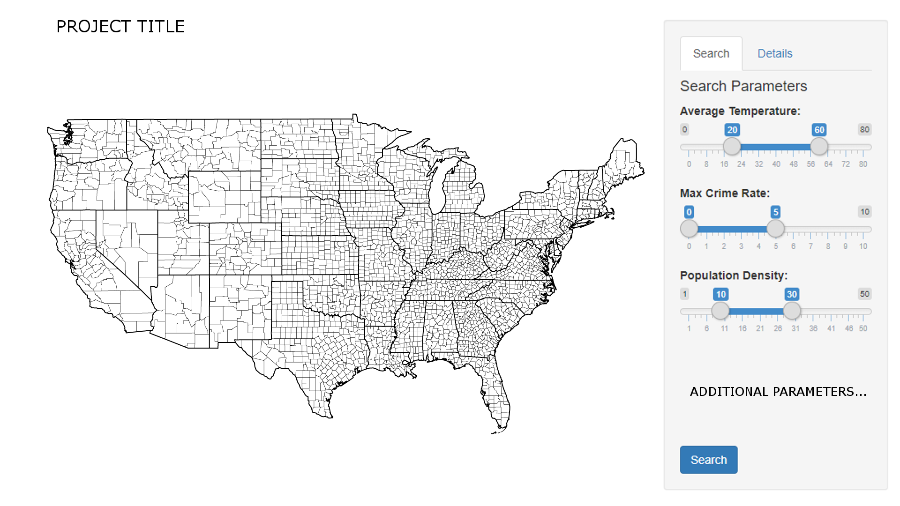

```{r set-options, include = FALSE}
# Sets default chunk options
knitr::opts_chunk$set(
  # Figures/Images will be centered
  fig.align = "center", 
  # Code will not be displayed unless `echo = TRUE` is set for a chunk
  echo = FALSE,
  # Messages are suppressed
  message = FALSE,
  # Warnings are suppressed
  warning = FALSE
)
```

```{r install-and-load-packages, include = FALSE}
# All packages needed should be loaded in this chunk
pkg_list = c('knitr', 'kableExtra', 'magrittr')

# Determine what packages are NOT installed already.
to_install_pkgs = pkg_list[!(pkg_list %in% installed.packages()[,"Package"])]

# Install the missing packages
if(length(to_install_pkgs)) {
  install.packages(to_install_pkgs, repos = "https://cloud.r-project.org")
}

# Load all packages
sapply(pkg_list, require, character.only = TRUE)
```

\newpage

# Introduction

For our Project, we decided to make a program that makes it simple and easy for the user to find a county in the United States that fits their desired needs. When people are choosing where to live, there are some standard factors that most people focus on in order to choose the best county to live in [@best-counties].

With our program you will be able to customize the parameters of multiple factors, and immediately see a map of the results that match your selections. This program will use `R` and `shiny` in order to make an easy to use, and highly beneficial tool for people that are looking for counties with certain attributes. The data being used will be from multiple sources that has different information about each county in the United States. These factors will include things such as Average Temperature, Crime Rate, Population Density, etc. The user will be able to select parameters for each one in order to find the best county for them.

# Related Work

There is a map of crime data [@crime], a map of home prices [@zillow], and a website for climate data [@climate], but there isn't one that combines all of these, and more.

# Methods

When the program starts, web scraping will begin with `rvest` [@rvest]. The HTML of the page will have to be parsed into data frames. While this is happening, a loading screen will be displayed as this may take a while. Variables of interest will be spliced from the data sets and combined into a master data frame.

On the UI side, the main section will be a map of the counties of the United States, created with `ggplot2`. There will be a sidebar with two tabs. The first tab will be a search panel. The user will be able to select bounds for variables of interest (Avg. temperature, Crime rate, etc.), and search for counties that match these criteria. The counties on the map will change color based on how well they match the parameters. Counties that completely match the desired values will appear green. Those that have properties within some relative error will appear yellow, and the remaining counties will appear gray. From here, the user is able to select a county. This will automatically switch to the second tab, Details.

In the details tab, there will be bar graphs that show every variable of interest for the selected county, colored based on how well they fit the search criteria. These will also be created with `ggplot2`. Because of the interactivity of the project, `shiny` will of course be used.

```{r data-science-workflow, out.width = "400px", fig.cap = "UI Prototype", fig.pos = 'H'}

```

# Feasibility


# Conclusion

Essentially, this project is geared towards those looking for the most affordable location to live at given their own preferences. This is done by allowing users to filter out variables that they don't care about. For example, someone who is already retired and doesn't have kids may not care a lot about the nearby education systems as opposed to a family with kids.

In summary, someone could pick what they variable(s) the most (such as a warmer climate or lower crime rate) and find the most affordable location based off of what they value. 

\newpage

# Appendix

\newpage

# References

R Core Team (2018). R: A language and environment for statistical computing. R Foundation for Statistical Computing, Vienna, Austria. URL
  https://www.R-project.org/.
  
Winston Chang, Joe Cheng, JJ Allaire, Yihui Xie and Jonathan McPherson (2018). shiny: Web Application Framework for R. R package version
  1.2.0. http://shiny.rstudio.com
